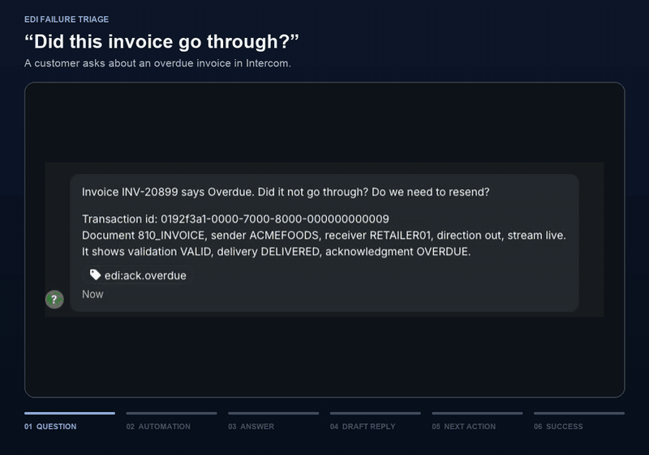
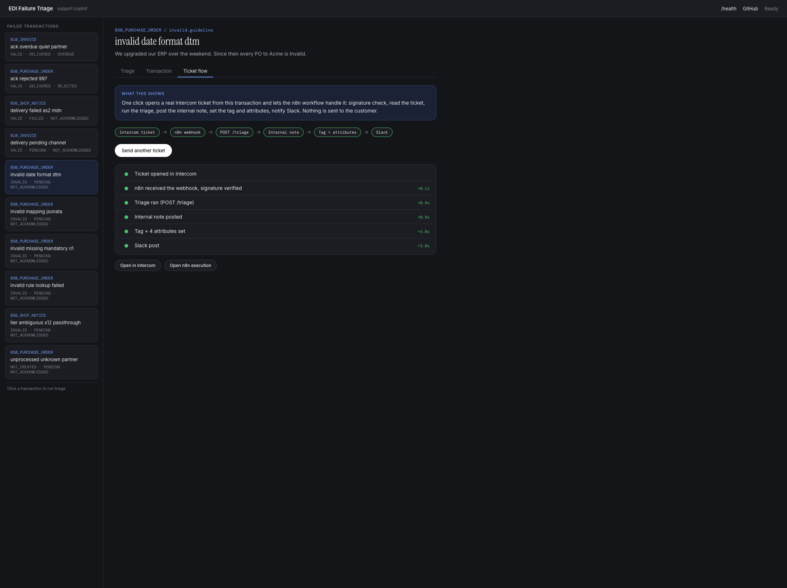

# EDI Failure Triage


**Live demo:** [edi-failure-triage.onrender.com](https://edi-failure-triage.onrender.com) (mock mode, Render free tier; the Ticket flow button is off there because the Intercom and n8n keys are not deployed).

A support copilot for a series of failed EDI transactions. In: the transaction's statuses, error text, a payload snippet, and the customer's note. Out: which integration path the customer is on, which failure state the transaction is in, two or three ranked causes with the evidence behind each, a draft customer reply, and the follow-up ("ticket two") that prevents the next ticket of the same kind.

Classification is code, not the model. The status values are documented and finite, so that step is a table lookup with a test for every branch. The model only does the parts that need judgment: ranking, tone, and the follow-up.

The same logic runs four ways: a CLI, `POST /triage`, an MCP tool named `triage_edi_transaction`, and a Claude Code skill in the format Orderful uses for its own support skills.



*Sped up 3x. Triage tab, then one click on **Send as Intercom ticket**, the note on the Intercom conversation, then the n8n execution that wrote it.*

## Provenance

The triage engine came first, as an AWS incident copilot in [aws-bedrock-ops-agent](https://github.com/h-vance/aws-bedrock-ops-agent). After reading the Product Support Engineer posting at Orderful, I spent a weekend pointing it at the transaction failure states in Orderful's public docs and wrote ten invented fixtures shaped after them. After finding Orderful's public [skills repo](https://github.com/Orderful/orderful-netsuite-skills), I split the EDI work into this repo and added a skill in that format, so the engine runs the way their support team already works. I have not used the Orderful product. Every partner, id, and payload here is made up. Where a fixture guesses at how an error surfaces, its `_note` field says so.

## Run it

```bash
pip install -r requirements.txt
python edi_triage.py fixtures/invalid_date_format_dtm.json
```

Raw JSON:

```bash
python edi_triage.py fixtures/ack_overdue_quiet_partner.json --json
```

The service, in mock mode with no AWS credentials:

```bash
BEDROCK_MOCK=true python server.py
```

Then open `http://localhost:8001` for the console, or call the API:

```bash
curl -s -X POST http://localhost:8001/triage \
  -H 'Content-Type: application/json' \
  -d @fixtures/delivery_failed_as2_mdn.json
```

Live Bedrock (needs AWS credentials; the default model id is a cross-region Claude inference profile, override with `BEDROCK_MODEL_ID`):

```bash
python edi_triage.py fixtures/ack_rejected_997.json --bedrock
```

## The skill

`skills/edi-failure-triage/SKILL.md` follows the structure of Orderful's public support skills: trigger prompts, required inputs, a numbered recipe, behavior rules, and reference links. `examples.md` next to it has three annotated sessions. `reference/edi-failure-taxonomy.md` is the shared reference the skill cites.

Claude Code picks the skill up from `.claude/skills/edi-failure-triage`, a tracked symlink, and reaches the MCP server through `.mcp.json`. To try it cold:

1. Start the server: `BEDROCK_MOCK=true python server.py`
2. Open Claude Code in this directory.
3. Say: "Transaction 0192f3a1-0000-7000-8000-000000000003 shows Invalid. Every PO to Acme since the weekend."

The skill gathers inputs, calls `triage_edi_transaction`, checks the classification against the taxonomy, and presents hypotheses, a reply, and a ticket-two proposal. It does not send, resend, or file anything.

[Orderful/orderful-netsuite-skills](https://github.com/Orderful/orderful-netsuite-skills) stays the canonical skill library. This skill classifies one failure and hands off: `fetch-validations` for the real error list, `item-lookup` for a missing item match, `monitor-mr` and `which-script-ran` for a stuck transaction, `reprocess-transaction` for an approved resend. The skill's *Canonical skill source* table has the full routing. Anything reusable that comes out of a run goes back there as a PR through `update-skills`, not into this repo.

## n8n workflow

`n8n/` holds the ticket-to-triage-note workflow (the first of several planned workflows): an Intercom conversation arrives, n8n reads it, calls `POST /triage`, and leaves an internal note, four conversation attributes, a tag, and a Slack post. Nothing customer-facing is sent. The workflow is n8n Workflow SDK code generated by `n8n/build-workflow.py`; the two JS snippets it embeds are tested by `tests/test_n8n_js.py`. Setup and demo steps are in [n8n/README.md](n8n/README.md).

The console shows the workflow live. Every transaction has a **Ticket flow** tab with one button, **Send as Intercom ticket**. The server opens a real sandbox conversation from the fixture, fires the signed webhook, and the tab draws the timeline as n8n and Intercom do their work: ticket opened, webhook received with the signature verified, `POST /triage` ran, note posted, tag and attributes set, Slack. Each step shows seconds since the webhook, with links to the n8n execution and the Intercom conversation. The button is disabled with a reason when `.env` lacks `INTERCOM_ACCESS_TOKEN`, `INTERCOM_CLIENT_SECRET` or `N8N_MCP_TOKEN`; `server.py` reads `.env` itself, so no `set -a` is needed. `POST /demo/ticket` answers 503 for the same reason, so a deploy without those three variables (the `render.yaml` here, for one) cannot open tickets.



## MCP

The server mounts the MCP endpoint at `http://localhost:8001/mcp/` (streamable HTTP, stateless, trailing slash required). One tool:

`triage_edi_transaction(tx: FailedTransaction)` returns `hypotheses`, `customer_reply`, `ticket_two`, plus `transaction_id`, `tier`, `classification`, and `mode`. Any file under `fixtures/` works as `tx` as-is.

Without an MCP client:

```bash
curl -s http://localhost:8001/mcp/ \
  -H 'Content-Type: application/json' \
  -H 'Accept: application/json, text/event-stream' \
  -d "{\"jsonrpc\":\"2.0\",\"id\":1,\"method\":\"tools/call\",\"params\":{\"name\":\"triage_edi_transaction\",\"arguments\":{\"tx\":$(cat fixtures/ack_rejected_997.json)}}}"
```

Host and origin allowlists for the MCP endpoint come from `MCP_ALLOWED_HOSTS` and `MCP_ALLOWED_ORIGINS` (comma-separated, localhost by default).

## Intercom

Orderful runs support on Intercom, so the skill can start from the ticket and end on it.

Reading: install Intercom's own Claude Code plugin once (`/plugin install intercom`, then sign in). It is read-only, which is the right shape for reading tickets. The skill uses it to pull the customer's words. Outside Claude Code, `python intercom_bridge.py read <conversation_id>` prints the same text.

Writing: the plugin cannot write, so `intercom_bridge.py` does the one write the workflow needs. After the engineer approves, it posts the triage result as an internal note on the conversation. It never sends a customer-facing reply, and it cannot assign, tag, or close.

Setup, once, against a sandbox workspace:

1. In the Intercom developer hub, create an internal app for the sandbox and copy its access token.
2. `cp .env.example .env` and fill in `INTERCOM_ACCESS_TOKEN`. The file is gitignored.
3. Seed a conversation from a fixture, the way a customer would have written it:

```bash
set -a; source .env; set +a
python intercom_bridge.py seed fixtures/invalid_date_format_dtm.json
```

Then the loop:

```bash
python intercom_bridge.py read <conversation_id>
python edi_triage.py fixtures/invalid_date_format_dtm.json --json > result.json
python intercom_bridge.py note <conversation_id> result.json --dry-run
python intercom_bridge.py note <conversation_id> result.json
```

`--dry-run` prints the note without sending it. The bridge is stdlib only and about a hundred lines.

## Fixtures

| File | Classification | Tier | Ticket two |
|---|---|---|---|
| `unprocessed_unknown_partner.json` | unprocessed | orderful_json | knowledge_article |
| `invalid_missing_mandatory_n1.json` | invalid.guideline | orderful_json | rule |
| `invalid_date_format_dtm.json` | invalid.guideline | orderful_json | rule |
| `invalid_rule_lookup_failed.json` | invalid.rule | orderful_json | rule |
| `invalid_mapping_jsonata.json` | invalid.mapping | orderful_json | mapping_test |
| `delivery_pending_channel.json` | delivery.pending | orderful_json | alert |
| `delivery_failed_as2_mdn.json` | delivery.failed | orderful_json | alert |
| `ack_rejected_997.json` | ack.rejected | orderful_json | rule |
| `ack_overdue_quiet_partner.json` | ack.overdue | orderful_json | partner_contact |
| `tier_ambiguous_x12_passthrough.json` | invalid.guideline | x12_passthrough | knowledge_article |

Each fixture carries a `mock_result` block. Mock mode returns it by transaction id, falls back to the first fixture with the same classification, then to a generic "nothing is broken" result, so a demo cannot die on a screen share.

## What the fixtures borrow from the docs

Field names and status values follow the transaction API. The `errors[]` shape follows the acknowledgment API. Failure causes follow these pages on docs.orderful.com: Transaction statuses, Unprocessed Transactions, Fix an Invalid Transaction, Configure Guideline Requirements, Use the Rules Engine, AS2 Troubleshooting, Transaction delivery success and failure, Acknowledge a Transaction, Integration Overview. The transaction API does not document an errors array on the transaction itself; the fixtures put one there anyway, because that is what a support engineer has on screen.

## Environment variables

| Variable | Default | Purpose |
|---|---|---|
| `BEDROCK_MOCK` | `true` | Canned results from the fixtures instead of a model call |
| `BEDROCK_MODEL_ID` | `us.anthropic.claude-sonnet-4-6` | Bedrock model or inference profile id |
| `AWS_REGION` | `us-east-2` | Bedrock region |
| `PORT` | `8001` | Server port |
| `RATE_LIMIT_REQUESTS` | `20` | Requests per client per window on `/triage` and `/mcp` |
| `RATE_LIMIT_WINDOW_SECONDS` | `3600` | Window length |
| `CORS_ORIGINS` | localhost:8080 | Allowed browser origins |
| `MCP_ALLOWED_HOSTS`, `MCP_ALLOWED_ORIGINS` | localhost | MCP DNS-rebinding allowlists |
| `INTERCOM_ACCESS_TOKEN` | unset | Needed only by `intercom_bridge.py` |
| `INTERCOM_ADMIN_ID` | unset | Optional; otherwise the bridge asks `/me` |
| `INTERCOM_CLIENT_SECRET` | unset | Ticket flow tab: signs the demo webhook (n8n verifies it) |
| `N8N_MCP_TOKEN` | unset | Ticket flow tab: reads execution ids from n8n |
| `N8N_URL` | `http://localhost:5678` | Where n8n lives; the hosted demo points at n8n on Render |
| `N8N_WORKFLOW_ID` | the local workflow id | Id of the triage workflow on that n8n |

## Live run notes

The live path has been exercised through both error branches on a fresh Bedrock account: a model not enabled for the account returned an access error, and every enabled model then hit the daily token quota. Both were caught by the fallback, which returns a low-confidence result with `ticket_two.kind` set to `alert`. A successful live model response is still pending a quota increase.

## Development

```bash
pip install -r requirements-dev.txt
ruff check .
pytest
```

## Limits

- No calls to the Orderful API. With real access, the input would come from the transaction endpoint and the Validation Errors tab instead of a JSON file.
- No EDI parsing. The `snippet` is text the model reads.
- No retrieval over the docs. The prompt carries a short cheat sheet with page URLs.
- The console lists the ten fixtures. It does not let you paste your own transaction yet. The CLI and the skill do.

## License

MIT
